# Setup

## Servers

You will be assigned a server and schema to use. Please use the one that you are assigned to resolve any conflicts.

The server setup instructions below will use `training01.oraopensource.com` along with user `ac01`, adjust accordingly.

Server Name | URL
--- | ---
`TRAINING01` | `training01.oraopensource.com`
`TRAINING02` | `training02.oraopensource.com`
`TRAINING03` | `training03.oraopensource.com`
`TRAINING04` | `training04.oraopensource.com`
`TRAINING05` | `training05.oraopensource.com`

To connect to each server you will use the following SSH login credentials:

Name  | Value
--- | ---
username | `<given at workshop>`
password | `<given at workshop>`
port | `22`

## Applications

## SQL Developer

The following instructions cover how to connect to the database using SQL Developer. SQL Developer can be downloaded [here](http://www.oracle.com/technetwork/developer-tools/sql-developer/downloads/index.html). You will connect over a secure SSH connection.

### Windows 7/8/10 Users

If you run the version of SQL Dev with JDK included and get the following error message:

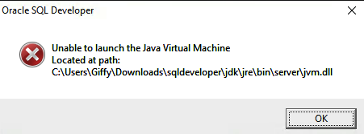

Read [this article](https://community.oracle.com/thread/3775616?start=0&tstart=0) on a possible solution. It recommends copying `sqldeveloper\jdk\jre\bin\msvcr100.dll` to `c:\Windows\System32\`

### SSH Configuration

Click `View` > `SSH`.

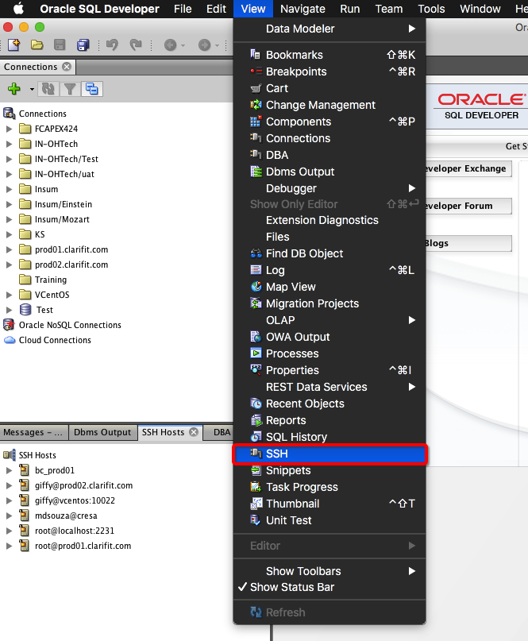

A new _SSH Hosts_ window will appear. Note the location may vary depending on you setup.

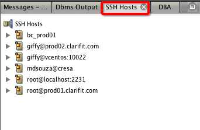

Right click on the root `SSH Hosts` entry and select `New SSH Host`.

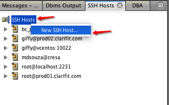

Make the changes highlighted in the red boxes below and click the `Ok` button to save.

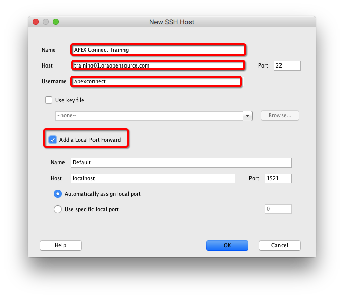

### Add Connection

Click the green `+` icon and select `New Connection`.

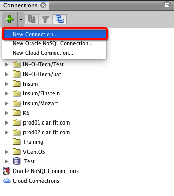

Modify the highlighted fields. Use the username and password that you were given. Don't click `Save` yet.

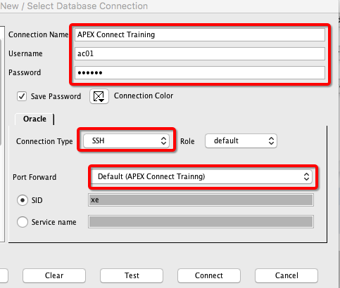

Click on the `Test` button to test the connection.

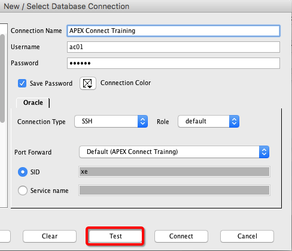

You should see a SSH Authorization confirmation window like below. Click the `Yes` to continue.

You will be prompted for a password. Enter the SSH password that you are provided with.

**_Note: Windows users, do not copy password from Notepad. Open in SQL Developer or a better text editor._**

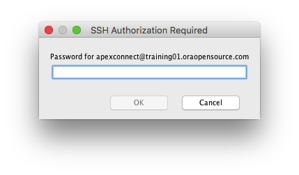

If everything goes well you should see a `Status: Success` in the bottom left corner of the window.

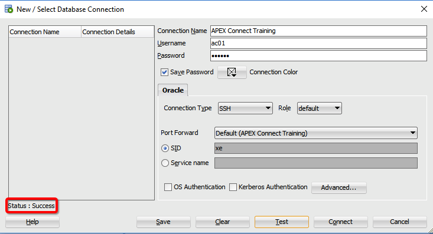

Click `Save` then `Connect` to connect to the schema.

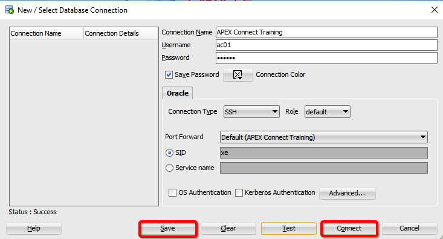
